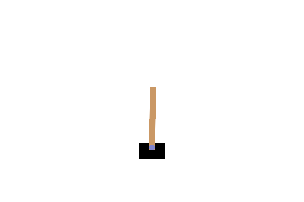
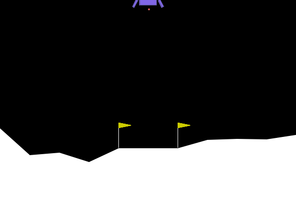
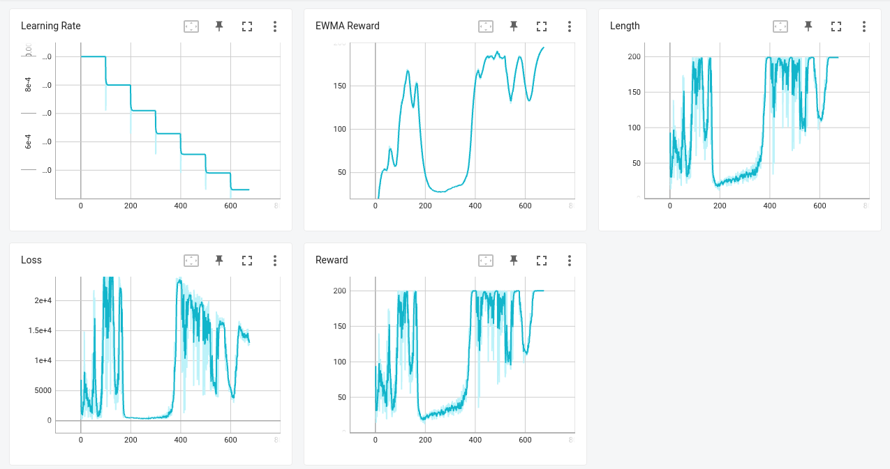
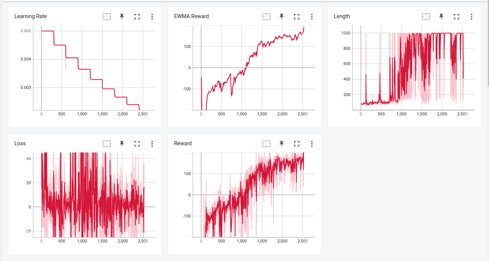
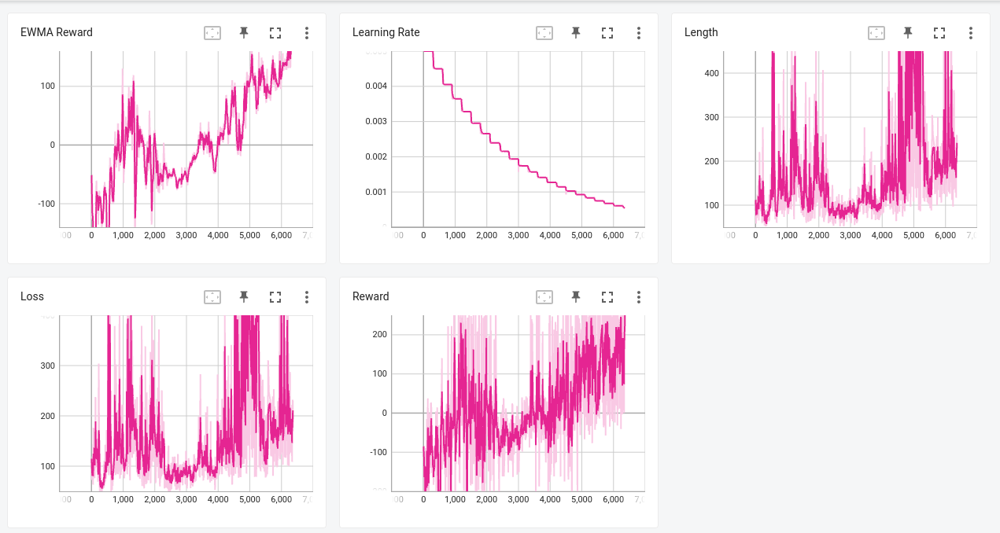
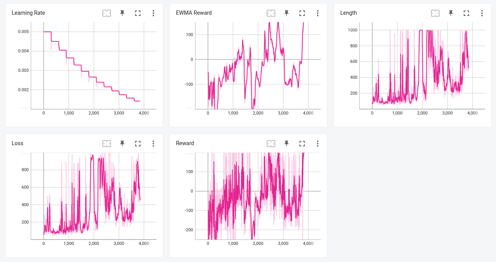
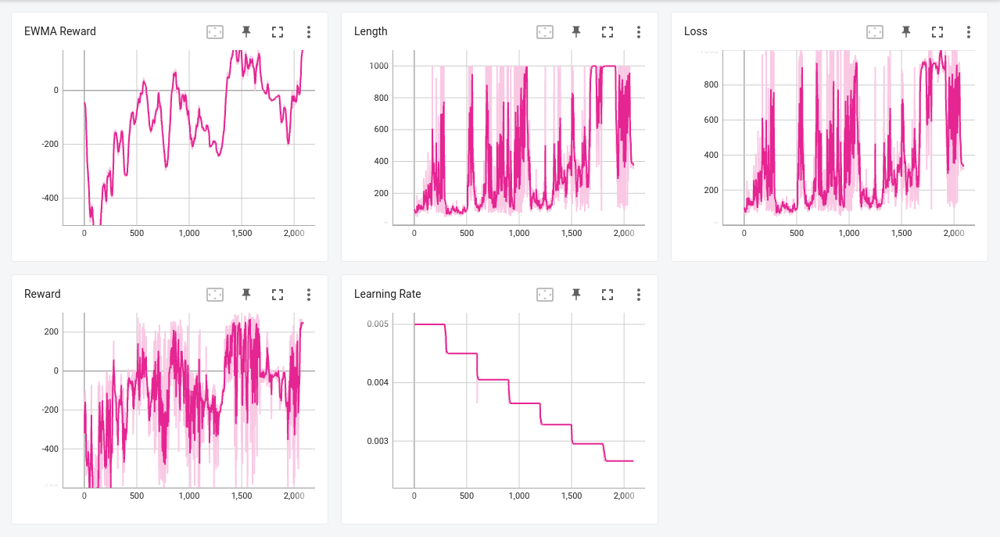

# Policy Gradient and Model-Free Prediction

## Problem 1 (Baseline for Variance Reduction)

[Report](./Spring2023_RL_HW1_311511052.pdf)

## Problem 2 (Policy Gradient)

[Report](./Spring2023_RL_HW1_311511052.pdf)

## Problem 3 (Monte Carlo Policy Evaluation)

[Report](./Spring2023_RL_HW1_311511052.pdf)

## Problem 4 (Policy Gradient Algorithms With Function Approximation)

<table>
    <tr>
        <th>
            Task
        </th>
        <th>
            GIF
        </th>
    </tr>
    <tr>
        <td>
            CartPole-v0
        </td>
        <td>
            
        </td>
    </tr>
    <tr>
        <td>
            LunarLander-v2
        </td>
        <td>
            
        </td>
    </tr>
</table>

### REINFORCE

### REINFORCE with Baseline

### REINFORCE with Generalized Advantage Estimation

$\lambda = 0.99$

$\lambda = 0.98$

$\lambda = 0.97$

