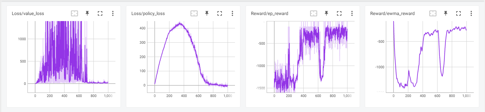
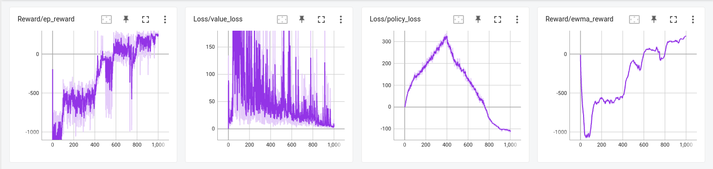

# DDPG and TRPO

## Problem 1 (Surrogate Function in TRPO)

[Report](./Spring2023_RL_HW2_311511052.pdf)

## Problem 2 (Solving TRPO Under Approximation Using Duality)

[Report](./Spring2023_RL_HW2_311511052.pdf)

## Problem 3 (Deep Deterministic Policy Gradient for Continuous Control)

### Pendulum-v1

Total epoch: 200

### LunarLanderContinuous-v2

Total epoch: 1000

